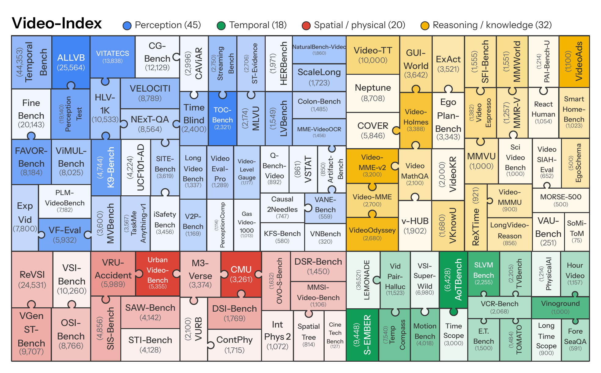

<h1 align="center">Video-Index</h1>

<p align="center">
  <a href="https://www.enxinsong.com/blog/video-index/"></a>
  <a href="https://huggingface.co/datasets/Video-Index/Video-Index"></a>
  <a href="https://arxiv.org/abs/2610.00960"></a>
  <a href="LICENSE"></a>
</p>

<p align="center">
  
  <br>
  <em>Video-Index. We sample 840 problems from the 505,518 in the 115 video benchmarks.</em>
</p>

Code for auditing video benchmarks with the **attack pyramid** and for evaluating models on **Video-Index**,
an 840-item benchmark composed from 76 public video benchmarks. The items and videos are on
[Hugging Face](https://huggingface.co/datasets/Video-Index/Video-Index), and the
[blog post](https://www.enxinsong.com/blog/video-index/) walks through the findings.

The repository holds three pipelines that share one library.

| Pipeline | Command | What it does | Guide |
|---|---|---|---|
| 1. Audit | `vi-audit` | Rebuilds the study: samples benchmarks, runs the attack levels, assigns breaking levels, attributes errors, screens the item pool, composes Video-Index | [docs/audit.md](docs/audit.md), [attribution](docs/attribution.md), [pool](docs/pool.md), [compose](docs/compose.md) |
| 2. Onboard | `vi-onboard` | Adds one new benchmark: adapter, format check, sample, videos, the audit stages for that benchmark, updated tables | [docs/onboard.md](docs/onboard.md) |
| 3. Evaluate | `vi-eval` | Scores a model on Video-Index; also available inside VLMEvalKit and lmms-eval, and as Harbor tasks for agents | [docs/evaluate.md](docs/evaluate.md), [Harbor](integrations/harbor/README.md) |

## Install

```bash
git clone https://github.com/Espere-1119-Song/Video-Index.git
cd Video-Index
pip install -e .                 # add ".[embeddings]" for the learned attacker and the pool
```

`ffmpeg` and `ffprobe` must be on the `PATH` for pipelines 1 and 2.

## Models

No stage names a concrete model. A stage asks for a *role*, and `configs/models.yaml` says which model fills it.

| Role | Task |
|---|---|
| `reference` | answers every item from 32 frames; its accuracy is the reference score of a benchmark |
| `attacker`, `attacker_small` | open-weight models of the attack levels and of the pool screen |
| `text_attacker` | answers from the question and options alone, and from the options alone |
| `captioner`, `caption_reader` | write captions, answer from captions |
| `judge_a`, `judge_b` | the two judges of the error attribution |
| `labeler` | assigns capability and scene labels |
| `verifier` | checks the marked answer of a Video-Index candidate against the frames |

Three providers are built in: `openai_compatible` (OpenAI, and every open-weight model served by vLLM, SGLang,
Ollama, LM Studio or TGI), `anthropic`, and `gemini`. `video_index.models.register_provider` adds another.

```bash
cp configs/models.example.yaml configs/models.yaml      # edit the roles
export ANTHROPIC_API_KEY=...  GEMINI_API_KEY=...
export VLLM_API_KEY=my-local-key                        # open-weight servers take a key as well
vllm serve Qwen/Qwen3-VL-8B-Instruct --api-key $VLLM_API_KEY --port 8000
```

Keys are read from the environment variables named by `api_key_env`. They are never written to a configuration
file, a log or a result file.

## Pipeline 1: audit

```bash
cp configs/audit.example.yaml configs/audit.yaml
vi-audit run --config configs/audit.yaml --models configs/models.yaml                      # the attack pyramid
vi-audit run --config configs/audit.yaml --models configs/models.yaml --stages attribution
vi-audit run --config configs/audit.yaml --models configs/models.yaml --stages pool,compose
vi-audit status --config configs/audit.yaml
```

`--stages` takes stage names or the groups `pyramid`, `attribution`, `pool`, `compose`, `all`; `--bench "A|B"`
restricts a run to some benchmarks; `--limit N` runs the first N items of every sample. Every stage is resumable:
finished items are skipped on a rerun.

## Pipeline 2: add a benchmark

```bash
vi-onboard check --name CG-Bench --repo CG-Bench/CG-Bench --adapter configs/adapters/cg_bench.yaml
vi-onboard add   --name CG-Bench --repo CG-Bench/CG-Bench --adapter configs/adapters/cg_bench.yaml \
                 --config configs/onboard.yaml --models configs/models.yaml
```

`check` reports the item format and the eligibility rules (English, multiple choice, no audio required, at least
30 multiple-choice items). `add` then samples, fetches and normalizes the videos, runs the audit stages and
writes the breaking level and the report card of the benchmark.

## Pipeline 3: evaluate a model on Video-Index

```bash
vi-eval run --model-config configs/models.yaml --role reference --protocol both --out runs/my-model
vi-eval score --run runs/my-model
```

Protocol: one frame per second, at most 512 frames, short side 224 pixels; the blind score is the mean over four
option permutations; scoring is rule based. The same protocol is available in
[VLMEvalKit](integrations/vlmevalkit/README.md) and [lmms-eval](integrations/lmms_eval/README.md); agents are evaluated with the [Harbor tasks](integrations/harbor/README.md).

## Layout

```
video_index/
  models/        model interface and providers
  config.py      roles and their fallbacks
  data/          item schema, frame sampling
  scoring.py     rule scorer
  audit/         attack pyramid, breaking levels, error attribution
  pool/          item pool: screening funnel, labels, coverage-first selection
  compose/       Video-Index composition and export
  onboard/       adapters, sources, format check, registry, watcher
  evaluate/      Video-Index evaluation
integrations/    VLMEvalKit and lmms-eval files, validation reports
configs/         example configurations and adapter specifications
assets/          Figure 1 of the paper
docs/            guides and design notes
tests/
```

## Tests

```bash
pip install -e ".[dev]"
pytest tests -q
```

## Licence

The code is released under Apache-2.0. The Video-Index items and videos come from their source benchmarks and
keep the licences of those benchmarks; see the dataset card.

## Citation

```bibtex
@article{song2026videoindex,
  title   = {Video-Index: A Curated Meta-Benchmark for Video Understanding},
  author  = {Song, Enxin and Xu, Yinuo and Yang, Shusheng and Chai, Wenhao and Gu, Jiatao},
  journal = {arXiv preprint arXiv:2610.00960},
  year    = {2026}
}
```
